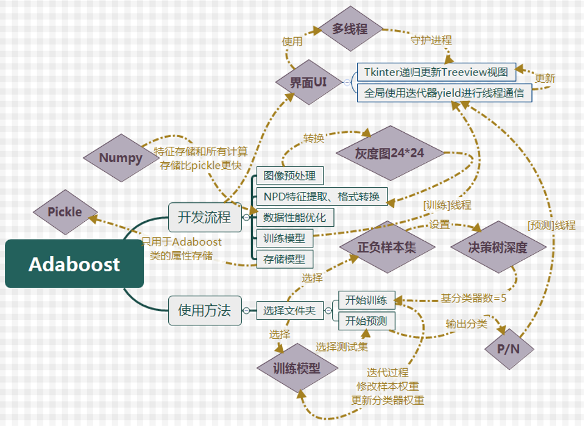

# Adaboost_V
## (目前只开放dev_v1.x开发分支，详情请移步dev_v1.x)
基于NPD特征+决策树(基分类器)的Adaboost图像识别算法的可调参可视化的模型训练&amp;预测
### 本项目自带Pos/Neg训练集(500x人脸和500x非人脸)和测试集Test以及一个已经训练好的train_model + 测试集的特征存储数组
### 版本V1.1
* 1.可调节基分类器决策树深度(默认为3)，基分类器数量默认为5
* 2.窗口可视化输出模型训练过程，包括提取NPD特征，初始化模型，数据存储和模型读取，模型在全体和验证集上的评估(准确率、召回率)
* 3.初步完善各类异常处理机制
* 4.预测结果自带统计以及完整标签对应输出

## 运行环境
### Python2.7/3.x(本项目在Python2.7下开发)

## 运行方法
### Python2.7/3.x环境下直接运行Main.py即可

## 我的开发思路(思维导图)
